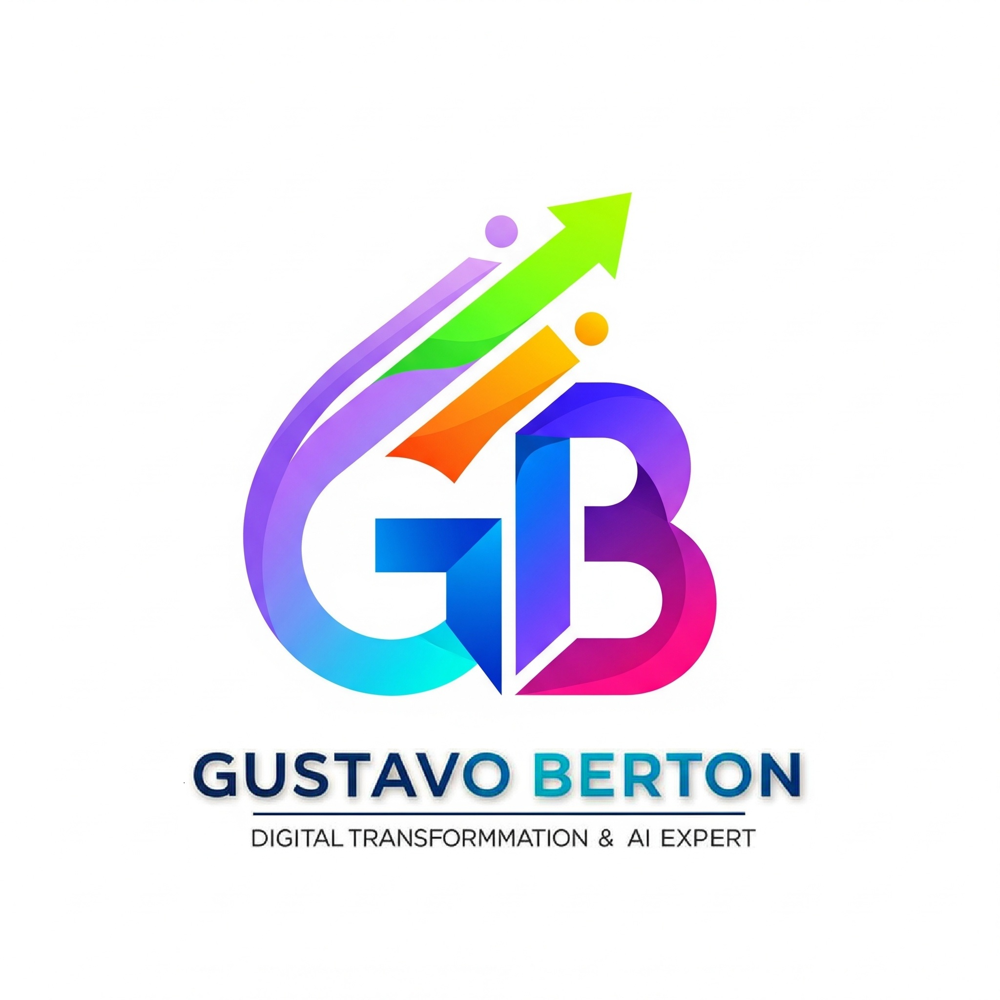
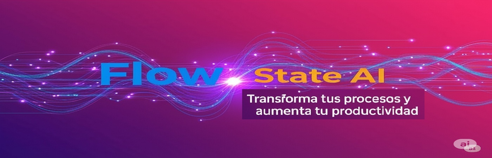

<table>
  <tr>
    <td width="20%" align="center" valign="middle">
      
    </td>
    <td width="80%" valign="middle">
       # 
GbertonAR: Capital Humano & Estrategia Tecnológica

    </td>
  </tr>
</table>

  

 

     
   <b>Transformando décadas de evolución tecnológica en soluciones de IA y Cloud</b>
    
        

        
        
      

   

---

### 🧠 Visión Estratégica: Más que Código

> "Usted no contrata un historiador; invierte en **capital humano** con alta capacidad de adaptación y ejecución probada."

Soy una inversión a largo plazo que garantiza trayectoria, entrega y constante innovación. Mi experiencia no es estática; es un flujo continuo que abarca:

* ⚙️ **Gestión de Críticas:** Desde equipos NCR/platos de discos hasta la crisis del 2K.
* ☁️ **Dominio Moderno:** Arquitectura Cloud e Inteligencia Artificial Generativa.
* 🛡️ **Mitigación de Riesgos:** Anticipación probada en entornos de alta presión (ex-Citibank).

Esta visión estratégica me permite asegurar el éxito del proyecto financiero con **liderazgo inquebrantable**, disciplina presupuestaria y resultados medibles.

---

### 🛠️ Stack Tecnológico & Habilidades

El equilibrio entre la **Inteligencia Conectada** y el **Soporte Humano**:

| **Liderazgo & Estrategia** (#TechLeadership) | **Core Técnico & IA** (#CloudComputing) | **Herramientas & Ops** (#DevOps) |
| :--- | :--- | :--- |
| 🏛️ Pensamiento Crítico | 🤖 Artificial Intelligence | 🐳 Docker / Kubernetes |
| 🤝 Gestión de Equipos | ☁️ Cloud Architecture (AWS/Azure) | 🐙 Git & GitHub Actions |
| 📉 Disciplina Presupuestaria | 🐍 Python / TensorFlow | 📊 Data Analysis |
| 🔄 Adaptabilidad (Flow) | 🕸️ Neural Networks | 🐧 Linux Systems |

---

### 📈 Flow de Trabajo (Estadísticas)

  
  

 

---

### 🎯 Objetivos & Colaboración

Estoy enfocado en proyectos que requieran **solidez arquitectónica** e **innovación aplicada**. 

* 🔭 **Actualmente trabajando en:** Integración de modelos LLM para optimización de procesos empresariales.
* 🤝 **Busco colaborar en:** Proyectos FinTech, Transformación Digital y Gobernanza de IA.
* 💬 **Pregúntame sobre:** Cómo migrar sistemas legacy a la nube sin perder la integridad operativa.

  #StrategicPlanning #CapitalHumano #FlowState #SeniorDeveloper #FinTech #DigitalTransformation

